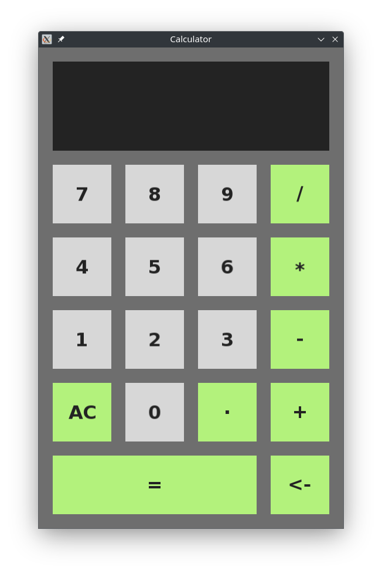

# :fire: :point_right: **Basic Calculator with SFML** :point_left: :fire:

This project is a **simple calculator** built using C++ and the **SFML** (Simple and Fast Multimedia Library). It serves as a way to **refresh the fundamentals of C++**, including object-oriented programming, event handling, GUI design, and high-precision arithmetic using **Boost Multiprecision**.

<div align="center">
  <a href="https://github.com/poprostuadam/basic_calculator_sfml">
    
  </a>
</div>

## **Table of Contents**

<details>
<summary>Click to expand</summary>

1. [Purpose](#one-purpose-smiley)
2. [Features](#two-features-star2)
3. [Learning Outcomes](#three-learning-outcomes-books)
4. [Technology Stack](#four-technology-stack-toolbox)
5. [Project Structure](#five-project-structure-open_file_folder)
6. [Installation](#six-installation-hammer_and_wrench)
7. [Usage](#seven-usage-desktop_computer)
8. [Debugging Mode](#eight-debugging-mode-mag)
9. [Contributing](#nine-contributing-handshake)
10. [Acknowledgments](#onezero-acknowledgments-trophy)
11. [License](#oneone-license-scroll)

</details>


## :one: **Purpose** :smiley:

The main purpose of this project is to:
- Revisit and practice **core C++ concepts**.
- Work with **SFML** for creating graphical user interfaces.
- Explore **Boost Multiprecision** for handling high-precision arithmetic.
- Reinforce problem-solving techniques through tasks like parsing expressions, converting to RPN, and evaluating mathematical operations.


## :two: **Features** :star2:

- **Basic Arithmetic Operations**: Addition, subtraction, multiplication, and division.
- **High Precision Calculations**: Utilizes Boost Multiprecision for accuracy beyond standard `double` types.
- **Interactive GUI**:
    - Buttons for numbers and operations (`+`, `-`, `*`, `/`).
    - Real-time display updates for user input and results.
- **Keyboard and Mouse Support**:
    - Use the GUI buttons or keyboard shortcuts for input.
    - Supports special keys like `Backspace`, `Enter`, and `Escape`.
- **Debug Mode**:
    - Logs tokenization, RPN conversion, and evaluation steps to the console.


## :three: **Learning Outcomes** :books:

Through this project, you can practice and learn:
1. **C++ Basics**:
    - Object-oriented design with classes like `App`, `Button`, `Calculator`, and `Display`.
    - Memory management (e.g., smart pointers with `std::unique_ptr`).
2. **Event-Driven Programming**:
    - Handling mouse and keyboard inputs with SFML.
3. **Algorithm Design**:
    - Implementing and using algorithms like **Shunting-Yard** and **RPN Evaluation**.
4. **Precision Arithmetic**:
    - Using Boost Multiprecision to perform high-accuracy floating-point operations.
5. **Debugging and Testing**:
    - Adding debug logs to understand internal program states.


## :four: **Technology Stack** :toolbox:

- **Language**: C++17
- **Graphics Framework**: [SFML](https://www.sfml-dev.org/)
- **Precision Library**: [Boost Multiprecision](https://www.boost.org/doc/libs/release/libs/multiprecision/)
- **Build System**: CMake
- **Platform**: Cross-platform (Linux (Manjaro))
- **IDE**: CLion


## :five: **Project Structure** :open_file_folder:

```bash
basic-calculator-sfml/
│
├── include/                 # Header files
│   ├── App.h                # Main application class
│   ├── Button.h             # Button component for UI
│   ├── Calculator.h         # Core calculator logic
│   ├── Display.h            # Display component for results
│   └── Config.h             # Configuration settings (colors, sizes, etc.)
│
├── src/                     # Source files
│   ├── App.cpp              # Implements App class
│   ├── Button.cpp           # Implements Button class
│   ├── Calculator.cpp       # Implements Calculator logic
│   ├── Display.cpp          # Implements Display rendering
│   └── main.cpp             # Entry point for the application
│
├── assets/                  
│   └── fonts/               # Fonts used in the application
│       ├── DejaVuSans.ttf  
│       └── DejaVuSans-Bold.ttf   
│
├── CMakeLists.txt           # CMake build script
├── LICENSE.txt              # License
└── README.md                # Project documentation
```

## :six: **Installation** :hammer_and_wrench:

### **Prerequisites**  :hammer:
1. **C++20**.
2. **CMake** (minimum version 3.30).
3. **SFML** library.
4. **Boost** library.
5. An IDE like **CLion** for easy setup and debugging.

### **Build Instructions** :gear:

1. **Clone the repository**:
   ```bash
   git clone https://github.com/poprostuadam/basic_calculator_sfml.git
   cd basic-calculator-sfml
2. **Configure and build the project:**    
   ```bash
   mkdir build
   cd build
   cmake ..
   make 
3. **Run the application:** 
   ```bash
   ./basic_calculator_sfml

## :seven: **Usage** :desktop_computer:

### **Running the Calculator** 

- **Mouse Support**:
    - Click on the GUI buttons for input.

- **Keyboard Shortcuts**:
    - Use the number keys, `+`, `-`, `*`, `/`, and `Enter` to perform calculations.
    - Use `Backspace` to delete the last character.
    - Press `Esc` to clear the input or exit the application.

## :eight: **Debugging Mode** :mag:

Enable debugging by setting `isDebug` to `true` in `Config.h`:

```c++
static constexpr bool isDebug = true;
```

This will log:

- Tokenized expression.
- Converted RPN.
- Step-by-step operations during evaluation.
- 

## :nine: **Contributing** :handshake:

This project is primarily for self-learning, but feel free to fork the repository and experiment. If you'd like to contribute, follow these steps:

1. Fork the repository.
2. Create a feature branch:

   ```bash
   git checkout -b feature-name


## :one::zero: **Acknowledgments** :trophy:

- [SFML](https://www.sfml-dev.org/) for providing a powerful and easy-to-use multimedia library.

- [Boost Multiprecision](https://www.boost.org/) for enabling high-precision arithmetic operations.

- DejaVu Fonts for the clean and elegant font used in the application.


## :one::one: **License** :scroll:
This project is licensed under the MIT License. See the LICENSE file for details.