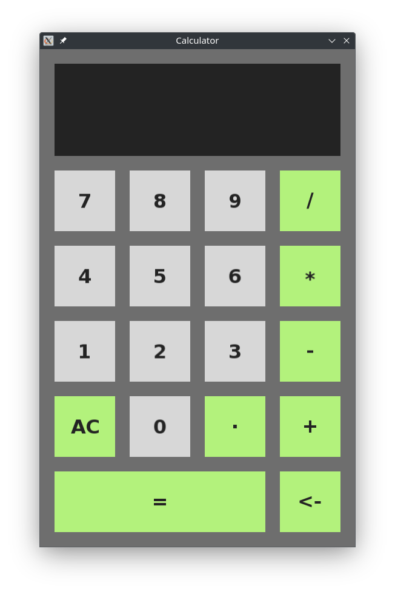

# Basic Calculator with SFML

[](https://isocpp.org/)
[](https://www.sfml-dev.org/)
[](https://cmake.org/)
[](https://github.com/poprostuadam/basic_calculator_sfml/actions/workflows/cpp-ci.yml)
[](LICENSE.txt)

A desktop calculator written in C++20 with an SFML graphical interface. The project combines event-driven GUI programming with expression tokenization, infix-to-RPN conversion, and high-precision calculations powered by Boost Multiprecision.

<p align="center">
  
</p>

## Features

- addition, subtraction, multiplication, and division,
- decimal-number input,
- 50-digit decimal arithmetic with `boost::multiprecision::cpp_dec_float_50`,
- operator precedence implemented through Reverse Polish Notation,
- mouse-operated calculator buttons,
- keyboard input for numbers and operators,
- clear, backspace, and error states,
- optional console logs for tokenization, RPN conversion, and evaluation,
- responsive button hover and active states.

## How it works

The application is split into four main components:

| Component | Responsibility |
| --- | --- |
| `App` | Owns the window, event loop, input handling, and UI composition. |
| `Button` | Renders a calculator button and handles its interaction states. |
| `Display` | Stores and renders the current expression or result. |
| `Calculator` | Tokenizes expressions, converts them to RPN, and evaluates them. |

The calculator evaluates multiplication and division before addition and subtraction. Invalid expressions and division by zero are displayed as `ERROR`.

## Requirements

- a C++20-compatible compiler,
- CMake 3.20 or newer,
- SFML 2.5 or newer,
- Boost headers.

On Ubuntu or Debian, install the dependencies with:

```bash
sudo apt update
sudo apt install build-essential cmake libsfml-dev libboost-dev
```

Package names differ between operating systems. SFML 3 is not currently supported because the application uses the SFML 2 event API.

## Build and run

Clone and configure the project:

```bash
git clone https://github.com/poprostuadam/basic_calculator_sfml.git
cd basic_calculator_sfml
cmake -S . -B build -DCMAKE_BUILD_TYPE=Release
cmake --build build --parallel
```

Run the executable from the build directory so the bundled font path resolves correctly:

```bash
cd build
./basic_calculator_sfml
```

For multi-configuration generators such as Visual Studio, build with `--config Release` and run the executable from the generated configuration directory while keeping the working directory set to `build`.

## Controls

| Action | Mouse | Keyboard |
| --- | --- | --- |
| Enter digits | Number buttons | `0`–`9` |
| Enter an operator | `+`, `-`, `*`, `/` buttons | Corresponding operator key |
| Decimal point | `.` button | `.` |
| Calculate | `=` button | `Enter` |
| Delete last character | `<-` button | `Backspace` |
| Clear display | `AC` button | `Escape` |
| Close application | Window close button | — |

## Debug mode

Set `config::isDebug` to `true` in `include/config.h`:

```cpp
static constexpr bool isDebug = true;
```

The application will print generated tokens, the RPN expression, stack operations, and intermediate results to the console.

## Project structure

```text
.
├── .github/workflows/cpp-ci.yml
├── assets/
│   ├── calculator.png
│   └── fonts/
├── include/
│   ├── App.h
│   ├── Button.h
│   ├── Calculator.h
│   ├── Display.h
│   └── config.h
├── src/
│   ├── App.cpp
│   ├── Button.cpp
│   ├── Calculator.cpp
│   ├── Display.cpp
│   └── main.cpp
├── CMakeLists.txt
├── LICENSE.txt
└── README.md
```

## Current limitations

- Parentheses and unary operators are not supported.
- The GUI layout uses fixed dimensions.
- The bundled font path assumes that the program is launched from the build directory.
- Automated tests are not yet included; CI currently verifies configuration and compilation.

## License

This project is available under the [MIT License](LICENSE.txt). The bundled DejaVu fonts retain their own applicable font licensing terms.
